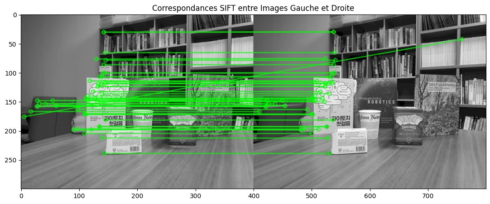
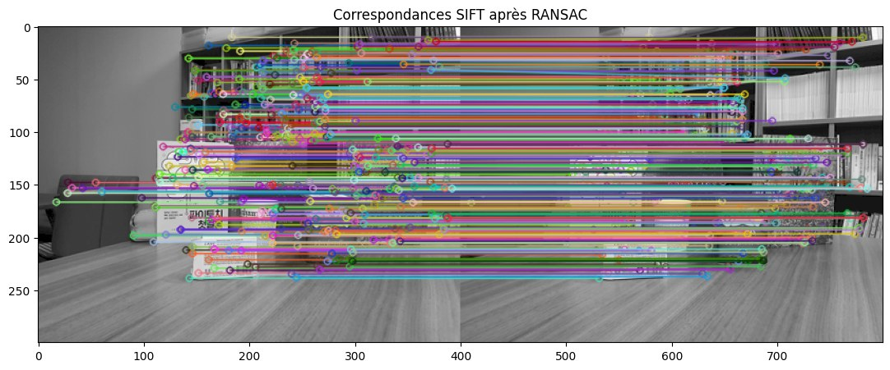
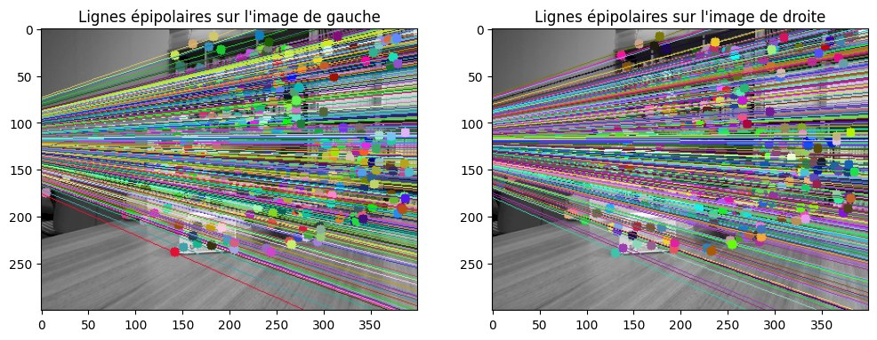
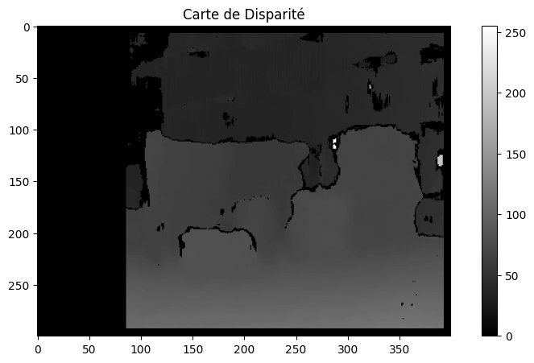

# Stereo vision: from SIFT matches to a disparity map

Recovering depth from two photographs of the same scene taken from slightly different
positions — the way two eyes do it.

Computer vision project · International School, Vietnam National University, Hanoi ·
supervised by Professor NGUYEN Thi Oanh

<p align="center">
  
</p>

---

## The idea

Hold a finger in front of your face and close one eye, then the other. The finger jumps.
A distant wall barely moves. **That difference in apparent displacement is disparity, and
it encodes distance** — the nearer an object, the more it shifts between the two views.

Computing it requires knowing which point in the left image corresponds to which point in
the right one. That is the whole problem.

---

## Method

### 1. Find distinctive points — SIFT

SIFT locates points that can be recognised again from another viewpoint: corners, printed
patterns, texture. It describes each one by its local neighbourhood in a way that survives
a change of scale or rotation, which is exactly what happens when the camera moves.

### 2. Match them — brute force with a ratio test

Every descriptor from the left image is compared with every descriptor from the right, and
the two nearest candidates are kept. If the best match is not clearly better than the
second, the point is ambiguous and both are discarded.

### 3. Discard the wrong matches — RANSAC

Even after the ratio test, matches remain wrong — repeated patterns on book spines look
alike. RANSAC repeatedly draws a small random subset, fits a geometric model to it, and
counts how many of the other matches agree. The model with the widest agreement wins, and
the matches that disagree with it are rejected.

**Why it works:** wrong matches disagree with each other as well as with the truth, so they
never form a large consistent group. Correct matches all agree with the same geometry.

<p align="center">
  
</p>

### 4. Recover the geometry — fundamental matrix, epipoles, epipolar lines

The **fundamental matrix** relates the two views: given a point in one image, it says that
its match in the other must lie on a particular line. That line is the **epipolar line**,
and all such lines pass through a single point, the **epipole** — the position of one
camera as seen by the other.

This is a strong constraint: it reduces the search for a correspondence from a whole image
to a single line.

<p align="center">
  
</p>

### 5. Build the disparity map — block matching

With the geometry known, `StereoBM` slides a window along the epipolar line and, for every
pixel, records the horizontal shift that best matches. Bright means close, dark means far.

<p align="center">
  
</p>

---

## What the results show

Matching is accurate where the scene has distinctive, non-repeating texture: the printed
boxes and the book covers. RANSAC removes most of the incorrect matches, which gives a
usable estimate of the fundamental matrix.

The disparity map reads correctly at large scale — the table in the foreground is clearly
nearer than the bookshelf. Two flaws are visible and both are expected:

- **A black band on the left.** For those pixels, the corresponding point lies outside the
  right image: there is nothing to match against, so no disparity can be computed.
- **Flat, noisy patches on uniform surfaces.** Block matching needs texture. On a plain
  wall, every window along the epipolar line looks the same, and the algorithm has no way
  to choose.

An additional experiment swapping the left and right images confirms that disparity is
signed: the geometry is mirrored, and epipolar lines run the other way.

---

## Running it

```bash
git clone https://github.com/al-fayed1998/stereoscopy-disparity-map.git
cd stereoscopy-disparity-map
pip install opencv-python numpy matplotlib
jupyter notebook stereo_disparity.ipynb
```

The notebook was written in Google Colab; the first two cells mount Google Drive and can be
skipped when running locally. Replace the image paths with your own stereo pair.

---

## Limits

- **Two images, one scene.** The method is demonstrated, not benchmarked: there is no
  ground-truth depth to compare against, so no error figure is reported.
- **`StereoBM` is the simplest block matcher available.** `StereoSGBM`, which enforces
  smoothness along several directions, would give a cleaner map on the uniform regions.
- **The images are not rectified.** Rectification would align epipolar lines with image
  rows and make block matching both faster and more accurate.

---

## Stack

Python · OpenCV · NumPy · Matplotlib · Jupyter

## Author

Mouhammad Thahir OUSMANE

## License

MIT
